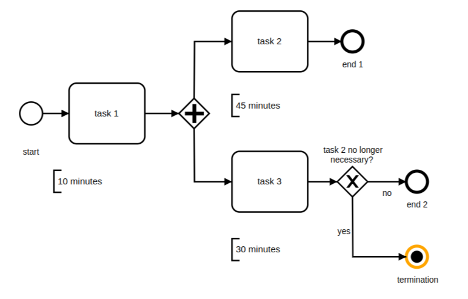
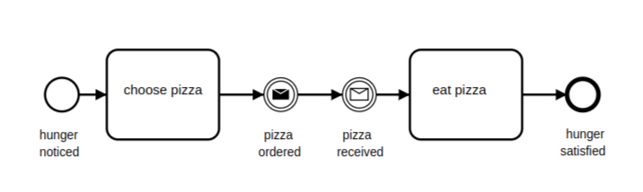
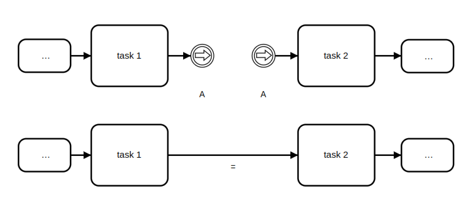
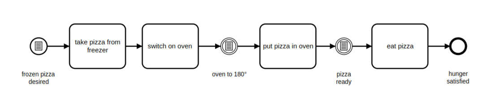

# Event

## Start Event

The start event is the first event in a process. It is used to start the process.
The task flowing from the start event is the first task in the process.

## Terminate Event

Use the terminate event to end a process. When you end a process, all the remaining tasks are skipped : no next actions are available, the trace is finished and cannot be reopened.

## Message Event 

The message event is used to send a message to a process. Inside of the process, you have multiple workflows, to make connect the workflows you can use a message event.

## Link Event
The link event is a special case. It has no significance related to content, but it facilitates the diagram-creation process. As shown below, you can draw two associated links as an alternative to a sequence flow. Here, “associated” means there is a throwing link event as the “exit point,” and a catching link event as the “entrance point,” and the two events are marked as a pair – in our example by the designation “A.”

## Conditional Event

Sometimes we only want a process to start or to continue if a certain condition is true. Anything can be a condition, and conditions are independent of processes, which is why the condition (like the timer event) can only exist as a catching event. A process cannot therefore conditional event trigger a conditional event.

We can enhance our pizza process with conditions. If we want to have frozen pizza, the process starts as shown in the diagram below. We take the pizza from the freezer and turn on the oven. But only after the temperature in the oven reaches 180 C do we put the pizza in, and only after it is done do we take it out to eat.

