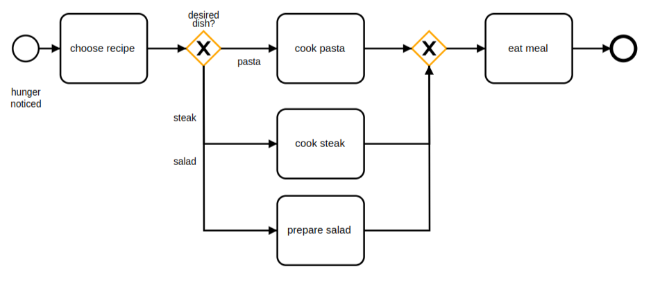
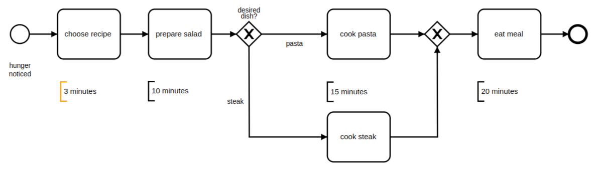
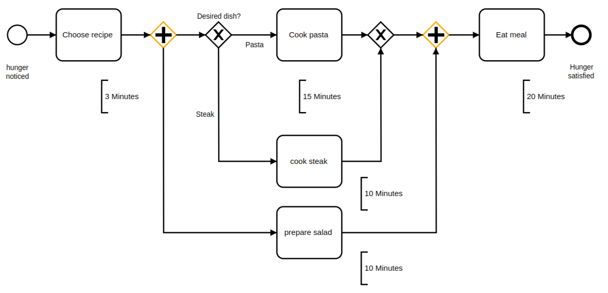
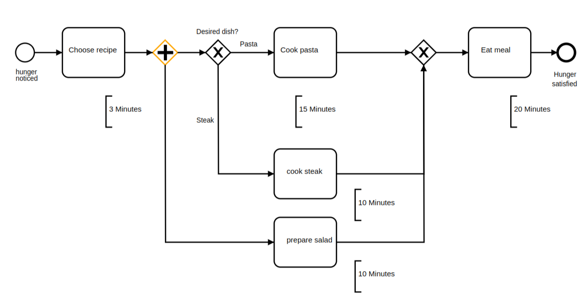
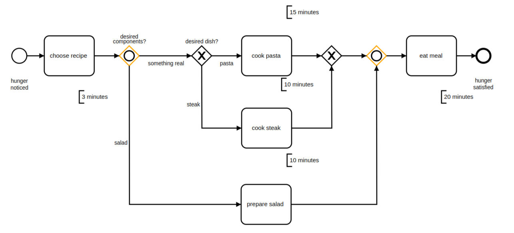

# Gateway

## Exclusive Gateways

Certain things can only be done under certain circumstances, so few processes always take the same course. In our simple example, we want to go into the details of cookery. Driven by hunger, we think about what we are going to cook today. We only know three recipes, so we choose one. We can either cook pasta or cook a steak or prepare a salad. Let’s say that these options are exclusive – we will never prepare more than one at a time. The point of decision on what to do next is called gateway. We decide based on available data (the chosen recipe) and we follow only one of the paths, which is a data-based exclusive gateway. We abbreviate “exclusive gateway” as XOR.

<Warning>
Bear in mind that a gateway is not a task! You have to determine facts and needs before reaching a gateway.
</Warning>

### Best Practice: Naming Conventions
As in the diagram above, we place the crucial question before the gateway. This is our convention, which has proved its value in our projects. Possible answers go on parallel paths after the gateway, which is how the BPMN specification shows them. We always work with XOR gateways as follows:

- Model the task that requires a decision for the XOR gateway.
- Model the XOR gateway after that.
- Create a question with mutually exclusive answers.
- Model one outgoing path (or sequence flow) for each possible answer, and label the path with the answer.

## Parallel Gateways

Suppose that now we want a salad on the side. If you want salad no matter what, you could model it as we have done in this diagram:

The total of the task times equals the running time of the process, which was a total of 48 minutes for pasta and 43 minutes for steak. Congratulations: you’ve just analyzed your first process based on key data!

Still, this means waiting 23 or even 28 minutes until you can start to eat. Insufferable! You’re really hungry, but what can you do? Maybe you don’t prepare the salad first and then cook the pasta or the steak, but you work on both at the same time – in parallel. The appropriate symbol is the parallel gateway, or the “AND gateway” for short, as shown in here:

Diagramming tasks as parallel does not make simultaneous processing compulsory. In contrast to the example shown before, it is also not imperative that you prepare the salad before starting other tasks. Parallel preparation does, however, reduce our total time by 10 minutes. It is classic process optimization to make tasks parallel as much as possible.

Check yourself: What if we draw the same process, but leave the AND merge out for lack of space, and the path from the “prepare salad” task leads directly to the XOR merge. What happens if we instantiate the process, and we decide in favor of pasta?

The token is generated and then cloned as always at the AND split. As soon as we finish preparing the salad, the token passes through the XOR merge and “eat meal” executes. Five minutes later,”cook pasta” also completes. Its token passes through the XOR merge and “eat meal” executes again! That’s not the behavior we wanted.

## Inclusive Gateways

We want to make our process even more flexible: When we are hungry, we want to eat

- Only a salad,
- A salad and “something real,” like pasta or steak, or
- Only something real.

If you want a more compact representation, you can use the data-based inclusive gateway – the OR gateway for short:

<Warning>
In practice, handling OR gateways is not as simple as these examples imply. It’s easy to understand that progress depends on waiting for another token to reach an OR merge. It can be harder to trace the synchronization rules with complex diagrams that sprawl across several pages.
</Warning>
