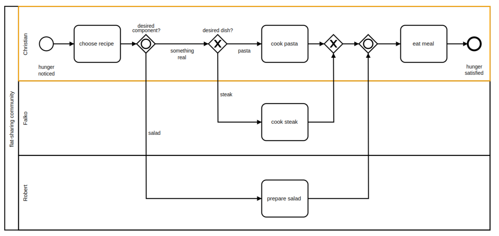

--- 
title: 'Participants'
description: 'Participants in a process'
---

# Participants

We already described how to use lanes to assign responsibility for tasks or subprocesses to different task managers. Lanes always exist in a pool, and the lane boundaries represent process boundaries from start to end. To BPMN, the pool represents a higher-ranking instance compared to its lanes. The pool assumes process control – in other words, it assigns the tasks. It behaves like the conductor of an orchestra, and so this type of process is called “orchestration.”

In the diagram below, the “conductor” arranges for Falko to process task 2 as soon as Robert completes task 1. The conductor has the highest-level control of the process, and each instrument in the orchestra plays the tune the conductor decides upon:

## The art of collaboration

We already examined the process represented below in connection with the event-based gateway:

Now consider the broader picture, and think about how this process happens from the point of view of the pizza delivery service. Presumably, it looks like here: As soon as we receive an order, we bake the pizza. Our delivery person takes it to the customer and collects the money, whereby the process completes successfully.

We want to link the two processes, that is, to examine the interaction of customer and delivery service from a neutral perspective. We can try to model this interaction by means of a pool and lanes as in here:

But this doesn’t work well: There are tasks and events that reference interaction within the pool – waiting for the delivery, for instance, or collecting the money. Other tasks are carried out by roles oblivious to their partners, such as baking the pizza and eating the pizza. It is impossible to differentiate the two visually. Strictly speaking, the diagram is not semantically correct because message events always refer to messages received by the process from outside, and that’s not the case here.

If we go with pools, the whole process looks like below. Both processes in the combined representation would look just as they did before, but now they connect through message flows. BPMN calls this form of visualization a collaboration diagram. It shows two independent processes collaborating.

## Lanes

We have talked about what to do in our processes, but we have not yet explained who is responsible for executing which tasks. In BPMN, you can answer this question with lanes.

The diagram shows that the tasks in our sample process were assigned to particular people. We can derive the following process description from the assignments: If Christian is hungry, he chooses a certain recipe. Depending on what Christian chooses, he can either take care of it himself (cook pasta), or he can get his roommates on board. If the latter, Falko cooks steak and Robert prepares salad. In the end, Christian eats. The three lanes (Christian, Falko, Robert) are united in one pool designated “flat-sharing community.”