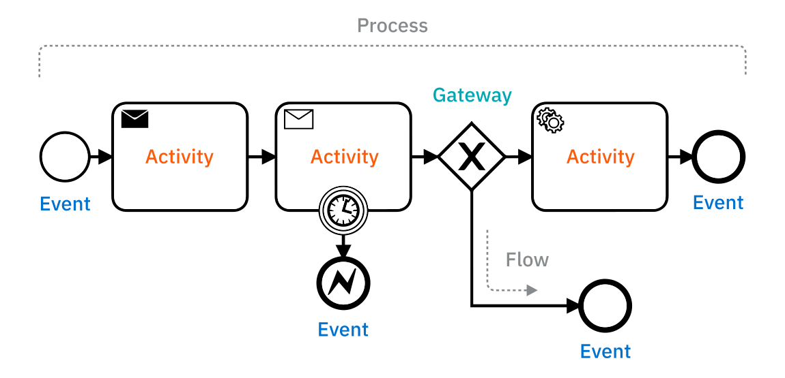

# It starts (and ends) with an event

There are over 100 unique elements that make up BPMN. For some, that can be overwhelming to start with. 

Fortunately, you can begin by looking at just two groups of symbols; flow objects and connecting objects. From there, you can keep expanding your understanding by putting BPMN into practice by modeling processes with greater complexity and more advanced BPMN symbols.

### Events

Describes a trigger that either starts, modifies, or completes a process.

### Activities

Represents an action (a task) that is taken, whether by technology or humans.

### Gateways 
These describe a decision point in a workflow, such as parallel (AND), exclusive (XOR), and Inclusive (OR) gateways.

### Flows
Connecting objects like associations, sequences, and message flows show how elements relate.

# Use swimlanes to show responsibilities across processes

BPMN 2.0 defines two different types of swimlanes to partition responsibility for different parts of an end-to-end process: pools and lanes. 

Pools act as a container to assign a set of tasks in a process and visually differentiate two or more independent processes. Pools contain lanes, which assign responsibility for subprocesses and tasks to show who is executing the tasks. BPMN calls this type of visualization a collaboration diagram. 

Pools should be clearly named with the name of the end-to-end process, for example, Customer Onboarding. You can designate as many lanes as you’d like, but they always exist within a pool.

To get started quickly, you can eliminate pools and only use lanes by modeling the sequence as normal tasks. However, avoiding pools in your diagrams limits your ability to produce diagrams that can represent real-world complexity