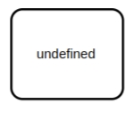
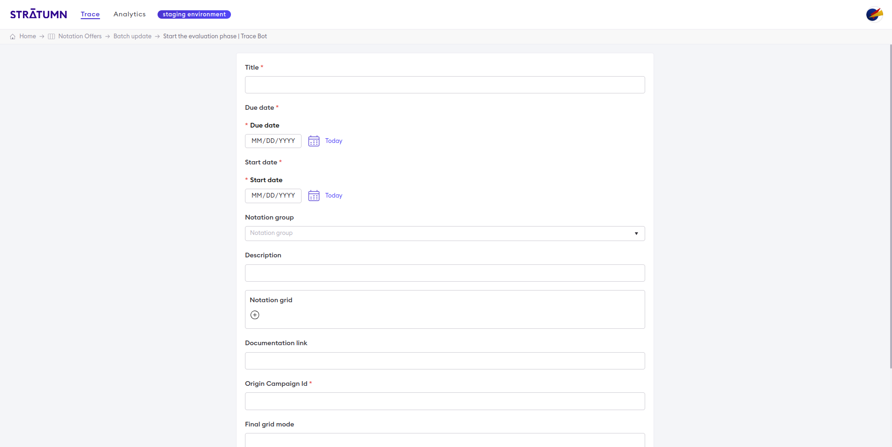
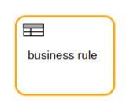
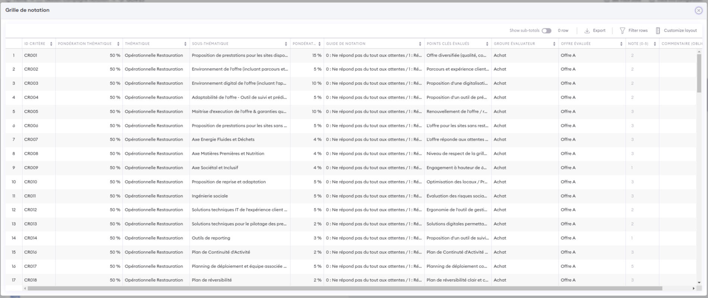
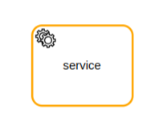

# Task

So far, we have used only tasks of undefined types, though BPMN provides the opportunity to work with task types just as it does for event types. Primarily, task types are intended to model processes that are technically executable. Task types are applied infrequently in practice. We know from experience, however, that task types can be particularly useful when modeling engineering requirements.

## Task types

Stratumn supports the following task types:

### Form action

In this case, the task is a form action. The user who needs to complete the task will be asked to fill in a form.
This form can be complexe, with multiple fields and validation. Data can be validated against a schema.

### Data Importer 

Stratumn support the import, view and edition of table of data. You can create business rules based on line of the table.
The data importer task type is used to import data from an external source.

<Note>
Stratumn only support the import of CSV and Excel file. Custom validation and remapping can be added.
</Note>

### Data Editor 

Like in the data importer, the data editor task type is used to edit a table of data.

For each line of the table, you can define a business rule, trigger an external process or call a function.

### Robot

A robot task type is used to operate autonomous task. When the task need to be executed, it will be instantiated and executed instantly.

